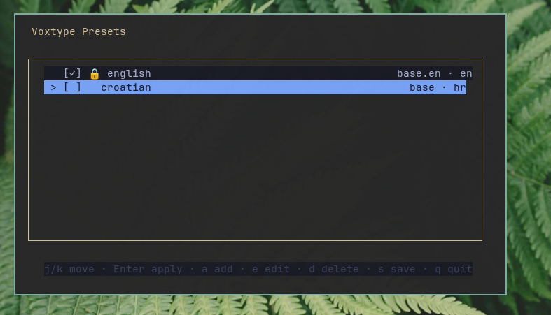
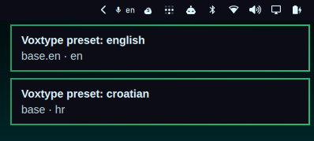
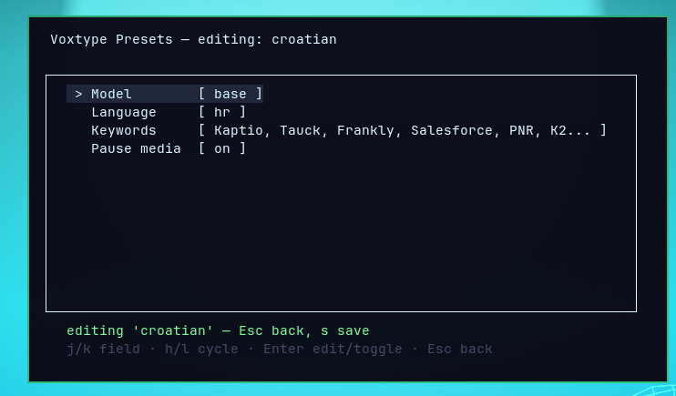

# Voxtype Switcher for Omarchy

[](https://omarchyplugins.com/)

Repository: https://github.com/Kristijan-K/omarchy-voxtype-plugin



Additional screenshots:





An Omarchy Quattro bar plugin for switching between user-defined **Voxtype
presets** — a name, **model**, **language**, keyword prompt, and media-pause
setting — with a real config reload.

This does not replace Voxtype's Dictation configuration or its normal
configuration screen. It adds a quick way to switch between saved voice input
presets, especially when changing languages or models during a call.

- **Bar widget** (`io.github.kkosu.voxtype-presets`): shows the active
  preset's language code (e.g. `󰍬 en`). **Left click** cycles to the next
  preset, **right click** opens the preset TUI.
- **One TUI for everything**: right-click opens `voxtype-presets` in a compact
  floating presentation terminal — presets list, apply, add, edit (model,
  language, keywords, and media pause), and delete all in one window.
- **Default preset**: `english` (`base.en` / `en`) is the Omarchy Quattro
  default and cannot be deleted.
- **Keybind**: optionally bind `SUPER + CTRL + ALT + V` to cycle quickly between
  voice presets during a call.
- **Presets** are stored in `~/.config/voxtype/presets.json`; applying one
  patches `[whisper] model`, `[whisper] language`,
  `[whisper] initial_prompt`, and `[audio] pause_media` in
  `~/.config/voxtype/config.toml` (comments preserved, timestamped backup)
  and restarts the `voxtype.service` user daemon — the only reload voxtype
  currently supports. Keyword and media overrides are available on non-default
  presets; the default remains editable after its initial configuration is
  copied.
- **Missing models download automatically**: switching to a preset downloads
  the selected model (a fast no-op when it is already present). Whisper
  models are fetched directly because Voxtype 0.7.5 incorrectly treats
  Whisper `small` as the optional SenseVoice model. Other engine models use
  `voxtype setup --download --model <name>`. The TUI does this inside the popup with a
  "downloading …" message; only when the model is available does it apply the
  config, reload the daemon, and close itself. On a download failure the
  popup stays open with the error and nothing is changed. The bar left-click
  and the cycle keybind download the same way.

## TUI keys

| Keys                          | Action                              |
|-------------------------------|-------------------------------------|
| `j` `k` / `↑` `↓`             | Move between presets or editor fields |
| `h` `l` / `←` `→`             | Cycle the selected editor field     |
| `Enter`                       | Apply the selected preset, or edit the selected editor field |
| `a`                           | Add a preset and open the editor    |
| `e`                           | Edit the selected preset            |
| `d`                           | Delete selected preset (`y` / `n`)  |
| `s`                           | Save all drafts, download missing models, apply the selected preset, then close |
| `Esc`                         | Return from the editor, or close the popup |
| `q`                           | Quit; with changes choose `y` save or `d` discard |

The editor shows four fields: `Model`, `Language`, `Keywords`, and `Pause
media`. Use `Enter` to type a model, language, or keyword value; use `h/l` to
cycle model/language values or toggle media pausing. The default preset is
also editable; only deletion is locked. Press `Esc` to return to the
preset list; continue editing other presets if needed, then press `s` there to
save all drafts and apply the selected preset. Exact duplicate model/language
combinations are rejected, while the same language may use different models.
Nothing is written until `s`, or until `q` is confirmed with the save option.

## Requirements

- Omarchy Quattro with the shell plugin system
- Voxtype installed and configured (`voxtype.service`)
- `bash`, `python3`, `jq`, and a terminal that supports `xdg-terminal-exec`
- A user systemd session; applying a preset restarts `voxtype.service`

## Install From GitHub

```bash
omarchy plugin add https://github.com/Kristijan-K/omarchy-voxtype-plugin.git --enable
```

The standard Omarchy installer validates the root `manifest.json`, clones the
repository into `~/.config/omarchy/plugins/io.github.kkosu.voxtype-presets/`,
and enables the widget in the right side of the bar. The CLI and TUI remain in
the plugin directory; the widget invokes them there, so no separate installer
or files in `~/.local/bin` are required.

On first use, the CLI seeds `~/.config/voxtype/presets.json` from the active
Voxtype configuration. Existing preset files are migrated when `migrate` is
run. To update a git-installed plugin:

```bash
omarchy plugin update io.github.kkosu.voxtype-presets
```

### Keybind

For quick language or voice-preset changes during a call, add this once to
`~/.config/hypr/bindings.lua`, then run `hyprctl reload`:

```lua
o.bind("SUPER + CTRL + ALT + V", "Cycle Voxtype preset", "bash -c '\"$HOME/.config/omarchy/plugins/io.github.kkosu.voxtype-presets/bin/omarchy-voxtype-presets\" cycle'")
```

The optional popup sizing rule is in `hypr/voxtype_presets.lua`. To use the
same compact `700x400` popup, add this line to your Hyprland configuration:

```lua
require("hypr.voxtype_presets")
```

## Remove

Disable and remove the plugin with the standard Omarchy command:

```bash
omarchy plugin remove io.github.kkosu.voxtype-presets --yes
```

This removes the plugin code but intentionally leaves Voxtype configuration,
preset data, backups, and the optional Hyprland rule or keybind for safety.
Remove those manually only if you no longer need them.

## CLI

```bash
PLUGIN="$HOME/.config/omarchy/plugins/io.github.kkosu.voxtype-presets"
CLI="$PLUGIN/bin/omarchy-voxtype-presets"

"$CLI" list          # presets.json
"$CLI" state         # active preset one-liner
"$CLI" cycle         # apply next preset
"$CLI" apply <name>  # apply specific preset
"$CLI" watch         # stream state (used by the bar widget)
"$CLI" seed          # first-run default preset
"$CLI" migrate       # normalize and preserve override fields
```

## Debugging

```bash
omarchy plugin list --json | jq '.[] | select(.id == "io.github.kkosu.voxtype-presets")'
omarchy-shell shell rescanPlugins
qs log -p /usr/share/omarchy/shell --tail 100
```

If the widget is not visible after installation, run:

```bash
omarchy plugin enable io.github.kkosu.voxtype-presets right
omarchy-shell shell rescanPlugins
```

## Publishing

This repository is structured for the Omarchy plugin marketplace: the root
contains `manifest.json`, `README.md`, `LICENSE`, `BarWidget.qml`, and all
runtime files referenced by the widget. Before submitting an issue to the
marketplace, validate the checkout with:

```bash
omarchy plugin validate .
qmllint -I "$OMARCHY_PATH/shell" BarWidget.qml
python3 -m py_compile bin/*.py
```
